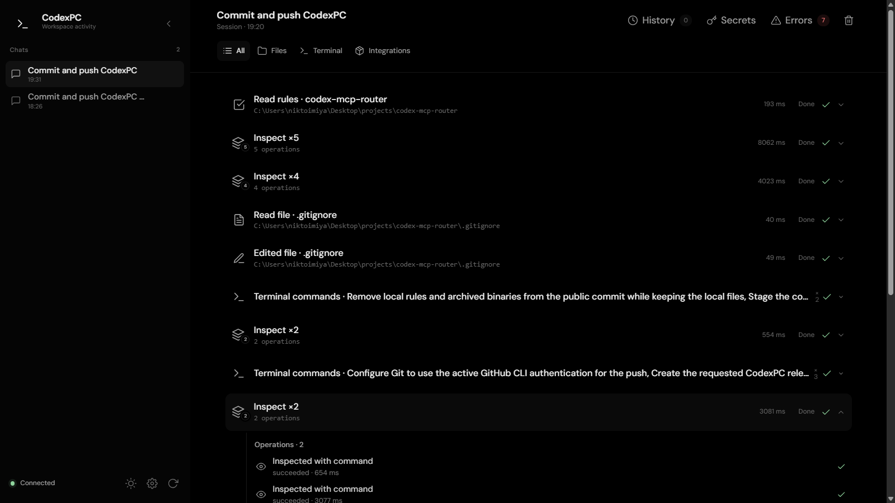
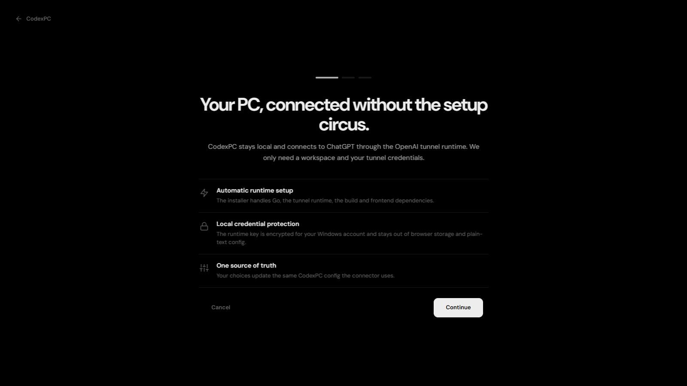

<div align="center">

# CodexPC

**Локальный control plane, который даёт ChatGPT нормальный доступ к вашему Windows-ПК через MCP — без превращения компьютера в кладбище shell-скриптов.**

[English](README.md) · [Настройка](docs/TUNNEL_SETUP.md) · [Архитектура](docs/ARCHITECTURE.md) · [Безопасность](SECURITY.md)

[](#быстрый-старт)
[](go.mod)
[](https://modelcontextprotocol.io/)
[](https://github.com/niktoimiyazap/codex-mcp-router/actions)
[](LICENSE)

<br>



<br>



</div>

```text
                 OpenAI Tunnel
ChatGPT  ─────────────────────────►  CodexPC
                                        │
                 ┌──────────────────────┼──────────────────────┐
                 │                      │                      │
                 ▼                      ▼                      ▼
          Codex app-server       Native Windows          Local frontend
          files · MCP · rules    commands · desktop      sessions · setup
```

CodexPC — это локальный MCP-мост поверх оригинального Codex app-server. Он даёт ChatGPT структурированный способ смотреть проекты, редактировать файлы, выполнять реальные dev-задачи, управлять Windows, вызывать другие MCP-серверы, держать долгие команды живыми и запрашивать подтверждение человека там, где появляются чувствительные данные.

Главная идея: **модель получает нормальные инструменты, а не одну огромную бесконтрольную shell-дыру.**

## Зачем CodexPC

| | |
| --- | --- |
| **Одна установка** | `install.cmd` готовит нужный Go, Python для frontend, Codex CLI, официальный `tunnel-client`, зависимости, сборку и smoke-тест. |
| **Внутри настоящий Codex** | Файлы, правила и downstream MCP используют оригинальный Codex app-server вместо кривого самописного велосипеда. |
| **Долгие задачи реально живут** | Нативные Windows-сессии команд могут переживать один MCP-вызов: их можно позже опрашивать, продолжать через stdin или останавливать. |
| **Секреты с человеком в контуре** | Учётные данные остаются в локальном vault. Чувствительное использование и прямой просмотр секрета могут требовать явного подтверждения. |
| **Полезный локальный UI** | Именованные чаты, история инструментов, background-процессы, approvals, ошибки, secrets и setup находятся в одном интерфейсе. |
| **Нативное управление Windows** | Скриншоты, мышь, клавиатура и прокрутка — отдельные инструменты, а не shell-костыли. |

## Быстрый старт

### 1. Скачайте CodexPC

Клонируйте репозиторий или скачайте ZIP:

```powershell
git clone https://github.com/niktoimiyazap/codex-mcp-router.git
cd codex-mcp-router
```

### 2. Запустите установку

Откройте `install.cmd` двойным кликом или выполните:

```bat
install.cmd
```

Установщик идемпотентный: если совместимая зависимость уже есть, CodexPC использует её и не устраивает переустановку ради переустановки.

Он подготавливает:

- версию Go из `go.mod`;
- Python для локального frontend;
- Codex CLI и авторизацию;
- официальный OpenAI `tunnel-client`;
- Go-модули, тесты, production-сборку и настоящий smoke-тест.

### 3. Закончите настройку в локальном UI

После установки откроется отдельная страница настройки CodexPC. Нужно выбрать:

- рабочую папку по умолчанию;
- профиль инструментов `core` или `full`;
- OpenAI Tunnel ID;
- runtime API key с нужными правами туннеля;
- при желании — имя tunnel profile и organization label.

Несекретные параметры записываются в обычный конфиг CodexPC. Runtime key шифруется **Windows DPAPI** для текущего пользователя и не попадает ни в TOML, ни в LocalStorage браузера.

Перед применением новых данных CodexPC проверяет их в изолированном временном профиле через `tunnel-client doctor`. Ошибочный ключ или Tunnel ID не уничтожит уже рабочую конфигурацию.

### 4. Обычный запуск

После первого setup используйте:

```bat
start.cmd
```

Launcher показывает короткую терминальную заставку CodexPC, поднимает локальный frontend, загружает сохранённую конфигурацию и дальше держит туннель под supervision.

## Какие инструменты получает ChatGPT

CodexPC специально разделяет действия на понятные инструменты вместо одного монолитного терминала.

| Область | Примеры |
| --- | --- |
| **Сессии и правила проекта** | `session_create`, `session_list`, `read_rules` |
| **Файловая система** | `fs_read_file`, `fs_edit_file`, `fs_write_file`, `fs_search`, `fs_copy`, `fs_remove` |
| **Терминал** | `command_inspect`, `command_exec`, `shell_exec`, `command_poll`, `command_write`, `command_terminate` |
| **Рабочий стол** | `computer` — скриншоты, мышь, клавиатура, прокрутка |
| **MCP-маршрутизация** | `mcp_discover`, `mcp_call`, `mcp_resource_read`, `mcp_reload`, `mcp_oauth_login` |
| **Секреты** | `secret_vault`, защищённый approval-инструмент `credential_value`, credential references для команд |
| **Control plane** | `connector_status`, аварийное управление процессами, батчинг через `multi_tool` |

Профиль `core` по умолчанию оставляет поверхность аккуратной. `full` дополнительно показывает compatibility- и diagnostic-инструменты.

## Как это работает

```text
start.cmd
   │
   └─ scripts/start-codexpc.ps1
          ├─ frontend/server.pyw ───────► http://127.0.0.1:8765
          └─ tunnel-client
                 │ MCP over stdio
                 ▼
           dist/codexpc-go.exe
                 │
                 ├─ Codex app-server ───► fs / rules / configured MCP servers
                 ├─ native command supervisor
                 ├─ Windows desktop control
                 └─ structured local state + logs
```

CodexPC держит одно долгоживущее соединение с Codex app-server и добавляет поверх него владение сессиями, политику путей, кэш MCP-инвентаря, нормализацию ответов, supervision процессов, approvals и локальный frontend.

Полная схема и request flow описаны в [Architecture](docs/ARCHITECTURE.md).

## Модель безопасности

CodexPC — привилегированное локальное ПО, поэтому модель доверия рассчитана на **одного доверенного пользователя Windows**, а граница доступа остаётся локальной.

- Frontend слушает только loopback (`127.0.0.1`) и использует локальный auth bootstrap cookie.
- Пути проверяются по `allowed_roots` до привилегированных файловых операций.
- Runtime key туннеля защищён Windows DPAPI.
- Секреты по возможности передаются как непрозрачные credential references.
- Чувствительное использование credentials может требовать явного approval во frontend.
- Логи и возвращаемые метаданные ограничиваются по размеру и редактируют секреты.
- Новый tunnel config проверяется до замены рабочего.

Не публикуйте сам коннектор или локальный frontend напрямую в интернет. Перед расширением границы доверия прочитайте [SECURITY.md](SECURITY.md).

## Конфигурация

Основной способ настройки — UI. Состояние пользователя по умолчанию хранится здесь:

```text
%LOCALAPPDATA%\CodexPCConnector
```

Несекретные настройки находятся в `config.toml`. Минимальный ручной пример есть в [`config.example.toml`](config.example.toml):

```toml
workspace = "C:/Users/you/projects"
allowed_roots = ["C:/Users/you/projects"]
tool_profile = "core"
```

Переменная `CODEXPC_STATE_DIR` переносит весь state directory. Все поддерживаемые ключи и launcher overrides описаны в [Configuration](docs/CONFIGURATION.md).

## Структура репозитория

```text
codex-mcp-router/
├─ cmd/codexpc/        точка входа Go
├─ internal/           ядро, app-server client, MCP, security, Windows control
├─ frontend/           локальный setup/activity UI и loopback server
├─ scripts/            установка, запуск, сборка и supervision
├─ docs/               архитектура, конфигурация и setup
├─ install.cmd         первый запуск / восстановление установки
├─ start.cmd           обычный пользовательский запуск
├─ config.example.toml справочник ручной конфигурации
└─ go.mod
```

`dist/` и `.local/` генерируются локально и специально исключены из Git.

## Сборка из исходников

Для разработки на Windows:

```bat
scripts\build.cmd -NoDesktopCopy
```

Pipeline запускает форматирование, `go test ./...`, production build, настоящий app-server smoke и staged deploy в `dist/`.

Или вручную:

```powershell
go fmt ./cmd/... ./internal/...
go test ./...
go build -trimpath -o dist/codexpc-go.exe ./cmd/codexpc
```

## Документация

- [Индекс документации](docs/README.md)
- [Архитектура](docs/ARCHITECTURE.md)
- [Конфигурация](docs/CONFIGURATION.md)
- [Первый запуск и tunnel setup](docs/TUNNEL_SETUP.md)
- [Политика безопасности](SECURITY.md)
- [Как внести вклад](CONTRIBUTING.md)
- [История изменений](CHANGELOG.md)

## Лицензия

CodexPC распространяется по [MIT License](LICENSE).
